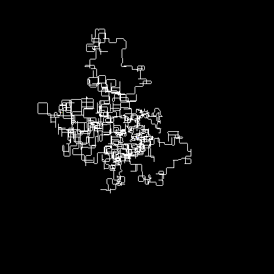

# Advent of Code 2022

This year I'm going to try creating graphical outputs for each puzzle, using [Processing](https://processing.org/) while I earn my ⭐s.

## Day 1: Calorie Counting ⭐⭐

An easy start, but I'm already reminded how clunky Processing and Java are as languages. To be fair, I had over-engineered the Elf class in part 1, thinking that I'd need the seperate values in part 2. In the end I could have just collapsed the values into a single calorie count per elf, and used a normal array, which would have been much less work.

## Day 2: Rock Paper Scissors ⭐⭐

This time I tried to keep things simple, to the point that I just coded a switch-case with the possible outcomes for the RPS game.

## Day 3: Rucksack Reorganization ⭐⭐

Increasingly, I'm reminded how bad an implementation Processing is. I was trying to use ArrayLists, which in Java would have allowed me to filter the list down to unique values (albeit with more implementation than a better language) but Processing for some reason doesn't allow ArrayLists of primatives, and although there's a `IntList` implementation, there is no `CharList` equivilent, or any easy way to convert a `char[]` or `String` into an `IntList`. In the end, writing a class to do the search operations was the simplest solution, although definitely not the most efficient.

## Day 4: Camp Cleanup ⭐⭐

After a little struggle with the `a = b` edge case, I had my first star. The second task was simple enough that I also slightly refactored the parsing, although not so much that it all moved into the parsing routine. (lazy coder!)

## Day 5: Supply Stacks ⭐⭐

This is the first time I can imagine using the graphical part of Processing. But first I had to parse the data and that was complicated enough that it got it's own class. Once I had the data structure laid out, part 1 was pretty straightforward. Since my part 1 operated on the parsed data model, I'm unable to run part 1 and 2 sequentially but, other than that, reworking the algorithm to move the stack was simple enough. Another lazy coder issue though: I didn#t bother with a graphical example of the task.

## Day 6: Tuning Trouble ⭐⭐

Simple one-line inputs (and having multiple examples) meant I had to rework my layout a little. But the token search for part 1 was simple enough.Part 2 didn't take much work, just a little refactoring to reuse the token search code.

## Day 7: No Space Left On Device ⭐⭐

Did I have to write a full folder system? Probably not. Havce I checked that the parsing works correctly? Nope.

The parse _seems_ to work perfectly, and the test data gives me the predicted answer, but my real input seems to be cinsistently falling short. I even had to resort to asking on the [subreddit](https://www.reddit.com/r/adventofcode/comments/zgcvdx/2022_day_7_part_1_my_solution_works_for_the/). Thanks to some hints from [u/kg959](https://www.reddit.com/user/kg959/) in the form of more test cases, I realised that by using a HashMap, I'd made the assumption that folder names would be unique across the file system; obviously not the case.

Part 2 was much simpler, and it turned out the list of sizes I'd generated for part 1 were all I needed; the directory tree is completely useless!

## Day 8: Treetop Tree House ⭐⭐

Something quick and simple to visualise at last! After a little stumble, due to some badly copied code, I thought I was cursed with forever low-balling my answers. But having rectified that, part 1 was in the bag. The visualisation will cycle through `vanilla trees` and `visible trees` when you press any key.

Figuring out the counting algorithm for higest tree took some time and trial and error, but eventially I was getting expected numbers for the example. The visualisation has a third option now colouring each tree in a gradient of how many trees are visible.

## Day 9: Rope Bridge ⭐⭐

Another one begging to be visualised, although this feels like the kind of simulation that could get out of hand by part 2. Coding up the rules for part 1 was easy enough, although running my input took **3 minutes and 15 seconds**! I did however get to see this:



Part 2 required some code rearrangement, but it wasn't too much work to extend my existing process. And somehow the rearrangements got my processing time down to **3 minutes and 11 seconds** even though we're dealing with more points in the rope.


## Day 10: Cathode-Ray Tube ⭐⭐

Dear diary, today I made a tiny Atari emulator, apparently. I hit a wall in part 1 for a little while, since I'd somehow read the instructions to check the `X` value every _20_ cycles, rather than 40. But after I'd rectified that mistake, the solutions to part 1 and 2 came pretty easily. It helped that I'd already implemented something close to the CRT when I'd created an oscilloscope to check the path `X` travelled during the program.

## Day 11: Monkey in the Middle ⭐⭐

The challenge today appears to be parsing the input data. It's eslecially problematic as Java (and therefore Processing) don't allow for passing functions as arguments. Fortunately the monkeys for my inputs all use one of three operations so I can just use a flag instead and hardcode the operations. After fighting with the `x ^= n` assignment operator, which doesn#t seem to do `x = x ^ n` like the docs say, but instead (in the one instance it was used) subtracted 2 from the value, I'd gotten my part 1 star.

Now that we're running for so many rounds and the worry factor never reduces,I had to rework the item values as `long`s to avoid the int overflow issue. That brought it's own issues in that the calculations appear to be incorrect now, but after some careful review of the recent changes and restoring the logs I had for part 1, I was getting correct values for part 1 again. Running part 2 reveled that even `long` isn't big enough, so it#s time to rework (again) using `BigInteger`. 

That solution _might_ work if I haveenough ram and time, but I never saw it progress beyond about 10%, so I dug around the subreddit to see what I'd missed. It turns out

> You'll need to **find another way to keep your worry levels manageable**.

did not mean `divide by 1` but that I should calculate a valid number ti divide by. I had a vague memory, from my A-level Maths, as to what I should do and checking through some of the solutions confirmed my hunch. Now my code runs at a decent speed, but yields the wrong answer again. Thanks to a small hint from [u/1234abcddcba4321](https://www.reddit.com/r/adventofcode/comments/zih7gf/comment/izrck61/) I'd fogured out the bug in my code and had subdued the monkeys on my back. I elected not te remove the `BigInteger` from my code because there are other things to do with my life.

## Day 12: Hill Climbing Algorithm ⭐⭐

I don't really have the energy to deal with this after a day's work. I've parsed the data and got a nice rendering of the terrain, along with some border walls for squares where the gradient is too steep, but before I can continue I'll need to refresh my knowledge of pathfinding algorithms.

 

I vaguely remembered the layout of the [sample algorith](https://en.wikipedia.org/wiki/Pathfinding#Sample_algorithm) from last year's challenges and got it implemented without too much difficulty. Once I'd completed the heatmap for the cells, I realised there was some issue with getting to the top of the mountain, and it wasn't until I saw [this meme](https://www.reddit.com/r/adventofcode/comments/zjqz5y/2022_day_12_is_my_input_invalid_or/) on the subreddit that I realised my folly. Filling out the rest of the algorithm was simple enough, just slow going, and eventually I had my path:

 

TFW your part 1 solution is complete enough that part 2 is almost nothing. It took me half an hour to complete, and a lot of that was getting the graphics to work:

 

## Day 13: Distress Signal ⭐⭐

I felt my wheels spinning as I tried to figure out how to parse this one, and after a few hours without inspiration, I had a look through the solutions megathread and took inspiration from [u/Premun](https://www.reddit.com/r/adventofcode/comments/zkmyh4/comment/j037c4c/?utm_source=share&utm_medium=web2x&context=3)'s parsing solution. Of course, implementing that in Processing's perculiar flavour of Java took a little more effort, but eventually I had the data, and I even had a working stringifier so I can print the packets to the console. The comparison algorithm was also heavily borrowed from u/Premun, so that first star is partially theirs.

That stringifier's going to come in handy for Part 2. I'm just going to have to decide on the best way to sort an immutable list in Java (Processing's `ArrayList.sort` method doesn't seem to work). In the morning, with _some_ sleep, I quickly whipped up the bubble sort and got the second star.

## Day 14: Regolith Reservoir ⭐⭐

I thought to draw this much larger and animate the sand grains though each of their positions as they fall, but the logic was much cleaner if I just use the pixel array, so today's visualisation is for ants.


Part 2 was a pretty easy extension of the existing code.


## Day 15: Beacon Exclusion Zone ⭐⭐

I was already planning to drw the sensor and beacon coverage, until I saw the solution required a count at row 2000000. After a quick glance at my input, all the value ranges are all in the high 1000000s so maybe some normalization might help. But first I need to parse the input and dig out the coordinates for sensors and beacons. I finally caved and researched how to use the sort function. It seems we need to write and instantiate our own Comparator class according to [Processing Discourse](https://discourse.processing.org/t/sorting-arraylist/5083) and [Processing forum](https://forum.processing.org/two/discussion/19469/sort-a-pvector-array#Item_9), Lets see about the puzzle dimentions then...

```
25 sensors, 7 unique known beacons
Dimentions: ( -1753094 -1123735 ),( 5349380 5181352 )
Size:  7102475 x 6305088
```

Throwing caution to the wind, I tried to start a sketch with a canvas that size, but

```exception
java.lang.OutOfMemoryError: Java heap space
    at java.awt.image.DataBufferInt.<init>(DataBufferInt.java:75)
    at java.awt.image.Raster.createPackedRaster(Raster.java:467)
    at java.awt.image.DirectColorModel.createCompatibleWritableRaster(DirectColorModel.java:1032)
    at java.awt.GraphicsConfiguration.createCompatibleImage(GraphicsConfiguration.java:186)
An OutOfMemoryError means that your code is either using up too much memory
    at processing.awt.PGraphicsJava2D.checkImage(PGraphicsJava2D.java:318)
because of a bug (e.g. creating an array that's too large, or unintentionally
    at processing.awt.PGraphicsJava2D.beginDraw(PGraphicsJava2D.java:328)
loading thousands of images), or that your sketch may need more memory to run.
    at processing.core.PApplet.handleDraw(PApplet.java:2361)
If your sketch uses a lot of memory (for instance if it loads a lot of data files)
    at processing.awt.PSurfaceAWT$12.callDraw(PSurfaceAWT.java:1527)
you can increase the memory available to your sketch using the Preferences window.
    at processing.core.PSurfaceNone$AnimationThread.run(PSurfaceNone.java:316)
```

Nope. I need a better strategy for that data. If I had infinite ram, the solution would have worked. I have a valid solution for the test data, and a visalisation to boot:


After a lot of headscratching, I was able to project a list of coverage for _just_ the target row, without having to draw the whole thing to memory. 

And part 2 was not too much of a departure from that technique really, just a small generalisation and a suprisingly quick bruteforce.

## Day 16: Proboscidea Volcanium

I get that I need to use some kind of optimal path finding algorithm here, but I'm not sure what that should be.

## Day 17: Pyroclastic Flow ⭐

Today was a day for self-playing tetris. Writing the engine took long enough, and then I just had to let it run for the first 2022 rocks. Even at a nominal 60fps it takes some time, since I move a block down one row per frame. I could optimize to calculate the drop for each brick and place it correctly, without redrawing, but where's the fun in that?

Ok, I see the fun in going fast for part 2. Having made the necessary changes to the rock counter (no int overflows for me) and implemented a gear change when we hit 2023 rocks, I just need to sit back and relax once more as I brute-force my way to the answer.

Oh crap this is going to take a long time, it's been almost a day and the rock counter is at 1838100. And this is running the test data to make sure I didn't mess up. At this rate, I won't have an answer before Christmas!

**Update:** After almost exactly 24h of running, we're still only at rock 2645000, at which rate it will take 500000 days to complete, and I started the process running with the test data. I can see from the visualisation that the bricks are repeating some pattern, and probably the good solution is to figure out the period of the pattern, and fastforward to 1000000000000 rocks that way.

## Day 18: Boiling Boulders ⭐⭐

This seems like a good excuse to explore Processing's [3D capabilities](https://processing.org/tutorials/p3d). It seems pretty basic, especially since you can't move things through 3d space,  you have to apply and remove translations and just draw the model at `(0,0,0)`. Also, the 3d scene isn't preserved between draw cycles, so everything has to be specified each frame. But for our purposes it seems fine and I got a voxel render of my lava blob pretty quickly. Of course the actual puzzle today doesn't even require a render. 

After the trauma of the last couple of days, part 1 was reletively easy today. Of course part 2 has to get complicated and I'm not sure how to solve that. Having completed Day 20, and still not having any spontaneous enlightenment about the solution here, I decided to browse the reddit for ideas. I found a post asking for [help understanding the wording](https://www.reddit.com/r/adventofcode/comments/zotj7t/help_2022_day_18_part_2_need_help_understanding/) which led me to a useful hint from [u/marvk](https://www.reddit.com/user/marvk/) to use a [flood fill algorithm](
https://en.wikipedia.org/wiki/Flood_fill). I could kick the algorithm off from any/all corners and then calculate the internal surface area. The implementation is pretty quick and dirty, there's definitely some duplicate checks in the search queue, but it was good enough for the puzzle's search space.

## Day 19: Not Enough Minerals

Now I'm expected to implement Factorio? Today's puzzle feels a lot like day 16's and I'm not sure of the best way to solve either.

## Day 20: Grove Positioning System ⭐⭐

Today seemed deceptively simple, until I realised I needed to keep track of the numbers I need to move, and the order to move them in. After some perseverance, I was able to get the elements moving in the same way as the example showed. And with reletively little effort, I was able to extend the code for part 2.

## Day 21: Monkey Math ⭐

I guess (hope) things are getting easier as we get closer to Christmas. Parsing and Part 1 were easy and quick. Part 2 is going to take some thinking about.

After a little puzzling, I figured out an algorithm to walk the tree and invert the operations, but the answer it spat out was `-3582317955835` which is apparently incorrect. Given all other monkeys shout positive numbers, I'm assuming this is a memory overflow issue, although the number is well within the range of the a `long`.

## Day 22: Monkey Map

## Day 23: Unstable Diffusion

Oh hey, it's time for GoL. After quickly diging out my old GoL Processing implementation, I remebered the technique I'd used to buffer current positions in the decisison phase. We'll see how we can use that for the particular rules of this puzzle. 

I've been working at this one for a while and I should have everything correct, but there seems to be a problem with the way I'm tracking the decisions, and my test elves move in a different way than the example shows.

## Day 24: Blizzard Basin

I like the idea of this one, and I think visualising this (at least the test data) would be fun. But actually solving the puzzle seems too complicated.

## Day 25: Full of Hot Air

So for this I need to write a two-way base-5 parser that also accounts for Roman numeral style negative numbers.
After a week of work, I found a few minutes to tackle this bwfore the year ends. The SNAFU->Decimal convertion is pretty easy, but I'm not too sure how to tackle the reverse function.
